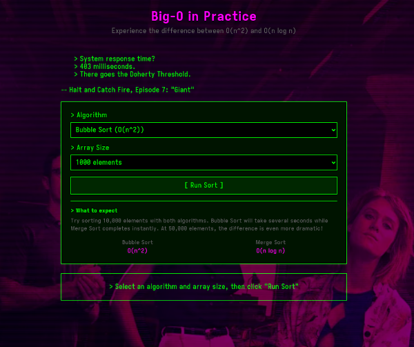

# The Doherty Threshold: A Big-O Visualization

-- by fsm 

> JOE: When engineers measure the speed of a PC, they talk about something called the "Doherty
> Threshold"... if it answers you back in less than 400 milliseconds, just under half a second, then
> you will stay glued to that machine for hours... But under 400 milliseconds, ah, that's the sweet
> spot.
>
> -- Halt and Catch Fire, S01E04

Every CS textbook teaches Big-O notation: O(n) vs O(n^2). We know O(n^2) is "slower," but we rarely
visualize the exact moment it becomes **unusable**.

Maybe I'm projecting, and everyone around me has kept that knowledge, but that's certainly not my
case: this is an exercise in refreshing Big O knowledge, step-by-step, based on a subset of possible examples.

The idea is to find out by building a "real" system that we can measure. We'll implement two sorting
algorithms in Go:

- Bubble Sort (O(n^2))
- Merge Sort (O(n log n))

and we the run them in Docker containers with Prometheus metrics to watch them "slow down" as N increases. We
then, through a user-facing web page, runs them against the **Doherty Threshold (400ms)** to demonstrate
exactly when an inefficient algorithm breaks the "immersion".

This project contains

1. **A Jupyter notebook** with a step-by-step explanation and visualisation of the merge algorithms ([try it on Binder](https://mybinder.org/v2/gh/fsmunoz/doherty-threshold/d7d795025a67a618178503a98c16573a94db3207?urlpath=lab%2Ftree%2Fdocs%2Fnotebooks%2FBigO.ipynb).
2. A Go implementation of BubbleSort and MergeSort, plus an HTTP server wrapper around them.
3. Prometheus configuration to centralise the metrics, and a Grafana dashboard to view them
4. Local, docker, and Kubernetes deployment options, simplified through Makefile targets
5. A web app ([also publicly available](https://big-o.interlaye.red/), with a matching "Halt and Catch
   Fire" theme and some old-skool tracker music =) ), built with [Datastar](https://data-star.dev/) hypermedia
   framework and the Go SDK, that uses the Go code and shows the time each merge algorithm works, allowing a
   comparison with the Doherty threshold.

   
There are many different ways to use this project, and some people will prefer the notebook, while others will
like to check the Go code and the way it's deployed, or just [visit the
site]((https://big-o.interlaye.red/)... this small project aims to clarify:


1. **Algorithm complexity has real-world impact**: 889x slower isn't "theoretical".
2. **Observability approaches**: Metrics, dashboards, instrumentation.
3. **Container-native development**: Docker, Kubernetes, proper health checks.
4. **Base Kubernetes deployment**: Resource limits, readiness probes, labeling, etc.

Those less interested in the Big-O angle can perhaps find something interesting in the deployment targets:
either backgrounded, or using GNU Screen, docker-compose, or Kubernetes, the `Makefile` is a good place to
check the different ways this project can be used.

## The experiment

We run these algorithms in Docker/Kubernetes with Prometheus metrics to answer **at what value of N does
Bubble Sort break the 400ms threshold?**

## Quick start

### Option 1: Docker Compose (aasiest)

```bash
make demo
```

Open Grafana at http://localhost:13000 (admin/admin) and watch the metrics roll in!

### Option 2: Kubernetes

```bash
# Build images and deploy to Kubernetes
make demo-k8s

# Access Grafana at http://localhost:30300 (admin/admin)
```

### Option 3: Local (No containers)

**Background mode (PID-based):**
```bash
make build
make run
```

**GNU Screen mode (visible logs):**
```bash
make demo-screen
# Or manually: make run-screen
```

## Deployment options

This project supports four deployment methods:

1. **Docker Compose**: Full stack with auto-configured Grafana dashboards
2. **Kubernetes**: Production-ready manifests with health checks and resource limits
3. **Local (GNU Screen)**: Multi-window terminal session with visible logs
4. **Local (Background)**: Direct binary execution for development

## Docker Compose deployment

### Prerequisites
- Docker and Docker Compose
- Go 1.23+ (for building)

### Commands

```bash
# Start everything
make docker-up

# View logs
make logs

# Stop everything
make docker-down
```

### Access Points
- Bubble Sort metrics: http://localhost:18080/metrics
- Merge Sort metrics: http://localhost:18081/metrics
- Prometheus: http://localhost:19090
- Grafana: http://localhost:13000 (admin/admin)

## Local Development (GNU Screen)

### Overview

Run all services locally in a GNU Screen session with visible logs in separate windows. This is ideal for development when you want to see real-time logs without Docker overhead.

### Prerequisites
- Go 1.23+ (for building)
- GNU Screen (pre-installed on most Linux/macOS systems)

### Commands

```bash
# Start all services in screen session
make run-screen

# This creates a screen session with three windows:
#   Window 0 (bubble): bubble-sort on port 8080
#   Window 1 (merge):  merge-sort on port 8081
#   Window 2 (ui):     web UI on port 8082
```

### Access Points
- Web UI: http://localhost:8082
- Bubble Sort metrics: http://localhost:8080/metrics
- Merge Sort metrics: http://localhost:8081/metrics

### Screen commands

```bash
# Attach to running screen session
make attach-screen

# Check if screen session is running
make screen-status

# Stop screen session
make stop-screen
```

### Inside the screen session

Once attached (via `make attach-screen`), you can:
- **Switch windows**: `Ctrl+a 0` | `Ctrl+a 1` | `Ctrl+a 2`
- **Detach**: `Ctrl+a d` (services keep running)
- **Help**: `Ctrl+a ?`

**Note**: Screen uses `Ctrl+a` prefix (tmux uses `Ctrl+b`). Since 'a' comes before 'b', Screen is clearly superior. QED.

## Kubernetes Deployment

### Architecture overview

(Check Emacs uniline mode https://github.com/tbanel/uniline !)

```
╭───────────────────────────────────────────────────────────────────╮
│ Namespace: big-o-demo                                             │
│                                                                   │
│  ╭──────────────╮  ╭──────────────╮  ╭──────────────╮             │
│  │ bubble-sort  │  │  merge-sort  │  │      ui      │             │
│  │  Pod:8080    │  │  Pod:8080    │  │  Pod:8080    │             │
│  ╰──────┬───────╯  ╰──────┬───────╯  ╰──────┬───────╯             │
│         │                 │                 │                     │
│         │   ╭─────────────▼───────╮         │                     │
│         │   │                     │         │                     │
│         └───▶  Prometheus:9090    │         │                     │
│             │  (scrapes every 5s) │         │                     │
│             ╰──────────┬──────────╯         │                     │
│                        │                    │                     │
│                ╭───────▼────────╮           │                     │
│                │  Grafana:3000  │           │                     │
│                │  (dashboards)  │           │                     │
│                ╰────────┬───────╯           │                     │
│                         │                   │                     │
╰─────────────────────────┼───────────────────┼─────────────────────╯
                          ▼                   ▼
                  NodePort:30300      NodePort:30301
                          │                   │
                          ▼                   ▼
          http://localhost:30300      http://localhost:30301
```

### Prerequisites
- Kubernetes cluster (kind, minikube, k0s, or any K8s cluster)
- kubectl configured
- Docker (for building images)
- kind CLI (for local development)

**Create a kind cluster** (if you don't have one):
```bash
kind create cluster --name big-o-demo
```

The Makefile will automatically load Docker images into [kind](https://kind.sigs.k8s.io/) - I've used kind
during development, slight changes might be needed for other solutions.

### Quick start

```bash
# Deploy everything to Kubernetes
make k8s-deploy
```

This will:
1. Build Docker images (`bubble-sort:latest` and `merge-sort:latest`)
2. Create namespace `big-o-demo`
3. Deploy all services with ConfigMaps, Deployments, and Services
4. Wait for pods to be ready
5. Display access information

### Access Grafana

**Option 1: NodePort (default)**
```bash
# Access Grafana directly via NodePort
open http://localhost:30300
```

**Option 2: Port-forward**
```bash
# Port-forward to Grafana service
make k8s-port-forward

# Then access at http://localhost:3000
```

### Kubernetes commands

```bash
# Check deployment status
make k8s-status

# View all logs
make k8s-logs

# View specific service logs (follows)
make k8s-logs-bubble
make k8s-logs-merge
make k8s-logs-grafana
make k8s-logs-prometheus

# Restart deployment
make k8s-restart

# Delete everything
make k8s-delete
```

### Manual Kubernetes deployment

If you prefer to run commands manually:

```bash
# 1. Build images
docker build -t bubble-sort:latest -f cmd/bubble/Dockerfile .
docker build -t merge-sort:latest -f cmd/merge/Dockerfile .

# 2. Load images into kind
kind load docker-image bubble-sort:latest
kind load docker-image merge-sort:latest

# 3. Deploy
kubectl apply -f deployments/kubernetes/big-o-demo.yaml

# 4. Check status
kubectl get all -n big-o-demo

# 5. Access Grafana
# NodePort: http://localhost:30300
# Or port-forward:
kubectl port-forward -n big-o-demo svc/grafana 3000:3000
```

### Kubernetes Architecture

The manifest creates:
- **Namespace**: `big-o-demo`
- **ConfigMaps**: Prometheus config, Grafana datasource, dashboard provider, dashboard JSON
- **Deployments**: bubble-sort, merge-sort, prometheus, grafana
- **Services**:
  - ClusterIP: bubble-sort, merge-sort, prometheus (internal)
  - NodePort: grafana (external access on port 30300)

### Production Features

The Kubernetes deployment includes:
- **Health Checks**: Liveness and readiness probes for all services
- **Resource Limits**: CPU and memory limits for stability
- **Labels**: Proper labeling for service discovery and organization
- **ConfigMaps**: Infrastructure as code for all configuration
- **Namespace Isolation**: Dedicated namespace for clean separation

### Resource Requirements

Minimal resource footprint suitable for local development:
- Bubble/Merge Sort: 100m CPU, 128Mi RAM
- Prometheus: 200m CPU, 512Mi RAM
- Grafana: 100m CPU, 256Mi RAM

Total: ~400m CPU, ~1Gi RAM

## Local Development

### Build
```bash
make build
```

### Run Tests
```bash
make test
make test-coverage

# Run benchmarks
make bench
```

### Interactive notebook

The notebook can be used through [nbviewer](https://nbviewer.org/), but I've added some support to start it
locally:

```bash
# Open Jupyter notebook with step-by-step visualizations
make notebook

# Requires Jupyter (install with `pip install jupyterlab`, or thorugh conda, or...)
```

### Run locally (background)
```bash
# Start services in background
make run

# Check if services are running
make status

# Check metrics
curl http://localhost:8080/metrics | grep sort_duration
curl http://localhost:8081/metrics | grep sort_duration

# Stop services
make stop
```

**Note**: For visible logs during local development, use GNU Screen mode instead (see "Local Development (GNU Screen)" section above).

## What you'll see

The Grafana dashboard shows:

1. **Time Series Graph**: Watch both algorithms process different array sizes
2. **Bar Gauges**: Compare durations side-by-side
3. **Performance Ratio**: See how many times slower bubble sort is

### Expected results

This is a possible outcome (will depend on your computer, etc):

| Array Size | Bubble Sort | Merge Sort | Ratio       |
|------------|-------------|------------|-------------|
| 100        | ~0.002s     | ~0.002s    | ~1x         |
| 1,000      | ~0.18s      | ~0.012s    | ~15x slower |
| 10,000     | ~18.4s      | ~0.089s    | ~206x slower|
| 50,000     | ~462s (8m)  | ~0.52s     | ~889x slower|

The visual impact is clear: bubble sort takes **8 minutes** to sort what merge sort handles in **0.6
seconds**.

## Project structure

A commented `tree` output to help navigate the code base:

```
.
├── README.md                    # This file
├── Makefile                     # Makefile
├── docker-compose.yaml          # Docker-compose manifest
├── bin                          
├── cmd                          # Service entry points (server + algorithms)
│   ├── bubble                   # Bubble sort + Dockerfile 
│   ├── merge                    # Merge sort + Dockerfile  
│   └── ui                       # Datastar-based web page  
│       ├── static               # images, style
│       └── templates            # index
├── deployments
│   ├── grafana                  # Grafana provisioning / configs
│   │   ├── dashboards           # Contains the actual dashboard
│   │   └── provisioning
│   │       ├── dashboards       # Sets up dashboard configuration, pointing above
│   │       └── datasources      # Prometheus datasource config
│   ├── kubernetes               # K8s manifest
│   └── prometheus               # Prometheus config
├── docs
│   ├── images                   # Images used by notebook
│   └── notebooks                # Jupyter notebook
└── pkg
    ├── algorithms               # Go code for merge and bubble sort
    ├── metrics                  # Prometheus instrumentation 
    ├── server                   # Go HTTP server 
    └── testdata                 # Test data generation

```

## Technology stack

- **Language**: Go 1.24
- **Containers**: Docker, multi-stage builds based on Google Distroless images
- **Orchestration**: Docker Compose + Kubernetes
- **Monitoring**: Prometheus + Grafana
- **Experimentation**: Jupyter notebook + Python
- **Web**: Datastar hypermedia framework, Go SDK.


Perfect for:
- Learning Big-O notation visually
- Understanding container orchestration
- Practicing Kubernetes deployments
- Portfolio demonstration of platform engineering skills

## License

MIT

